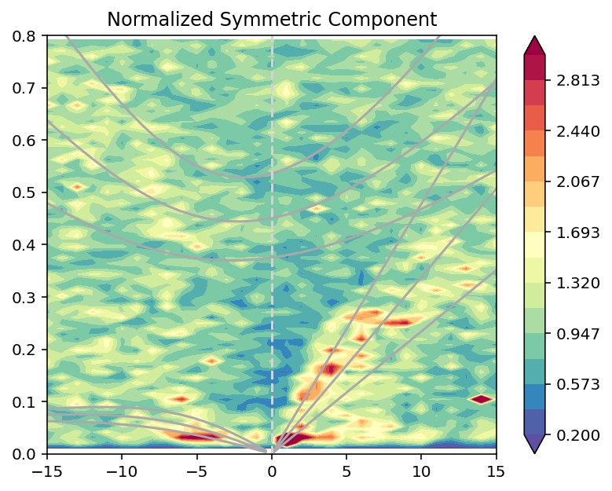
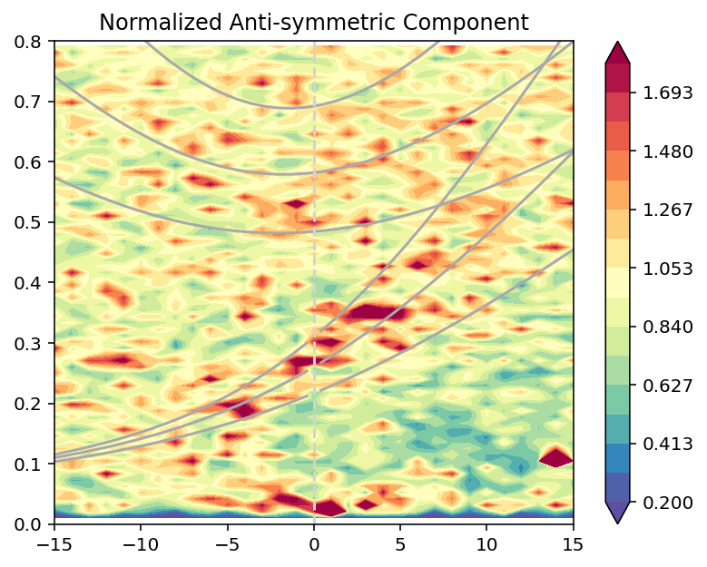

# `wavenumber_frequency`

A pretty straightforward implementation of the wavenumber-frequency spectral analysis following Wheeler & Kiladis.

The approach closely follows the NCL implementation. The main difference is that the filtering rule is simpler here. 

The file `wavenumber_frequency_functions.py` contains all the functions needed to produce "wheeler-kiladis diagrams." There are lots of notes included, including some directly copied from NCL's source code. 

The file `example_analysis_script.py` shows a skeletal start to analysis. I have omitted the data preparation, but it could be as simple as using `x = xarray.open_dataset()['precip']`. 

The file `example_analysis_like_ncl.py` shows an example that tries to reproduce the basic example from NCL. This is probably the place to start. I am even including the data file in the github, which I obtained from Dennis Shea / NCL. The output for me, using python 3.8, are these two plots:

At this point, I believe this approach produces results that are _very_ similar to NCL. This has only been tested, however, using daily mean precipitation from climate model output and the twice-daily example data. Missing/invalid data may not be handled correctly. Other variables should be fine because I do not think there are any hard-coded values or assumptions about the physical units, but I haven't tested.